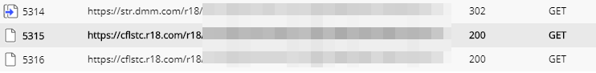

# r18-ripper

Rips purchased pornography off r18.com. Downloads the chunks, appropriate decryption key, and modifies the chunklist.

THIS DOES NOT DECRYPT DUE TO UNKNOWN ISSUES. `ffmpeg` or vlc should be able to put the pieces together for you.

# Usage

`r18rip <playlist URL> [--bitrate <integer>]`

ex.

`r18rip https://cflstc.r18.com/r18/st1:REDACTED/-/cdn/playlist.m3u8?ld=REDACTED`

Immediately after setting the bitrate in the r18 web player (auto works too, this just chooses the highest bitrate unless you specify otherwise), the first m3u8 requested by your browser, `playlist.m3u8` is what this wants.

Though, if you specify the second followup one, `chunklist_xxxxx.m3u8`, this can handle it too.

NOTE: So far as I can tell, these URIs are auth tokens in themselves. Do not share them with others.